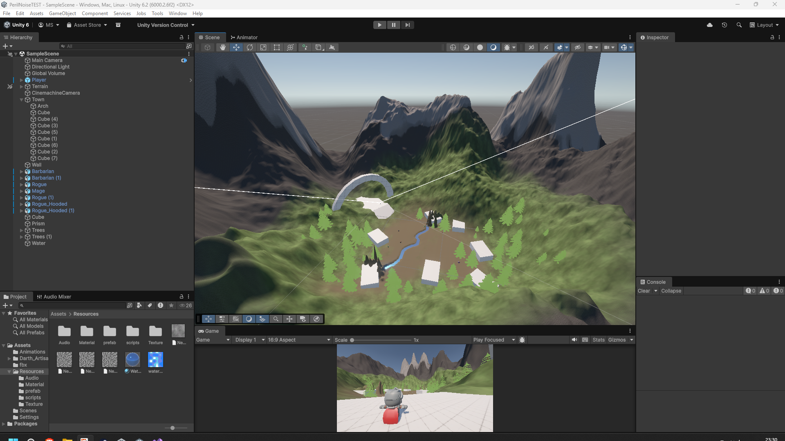

# <!DOCTYPE HTML>

# <!--

# &nbsp;	Dimension by HTML5 UP

# &nbsp;	html5up.net | @ajlkn

# &nbsp;	Free for personal and commercial use under the CCA 3.0 license (html5up.net/license)

# -->

# <html>

# &nbsp;	<head>

# &nbsp;		<title>Dimension by HTML5 UP</title>

# &nbsp;		<meta charset="utf-8" />

# &nbsp;		<meta name="viewport" content="width=device-width, initial-scale=1, user-scalable=no" />

# &nbsp;		<link rel="stylesheet" href="assets/css/main.css" />

# &nbsp;		<noscript><link rel="stylesheet" href="assets/css/noscript.css" /></noscript>

# &nbsp;	</head>

# &nbsp;	<body class="is-preload">

# 

# &nbsp;		<!-- Wrapper -->

# &nbsp;			

# 

# &nbsp;				<!-- Header -->

# &nbsp;					<header id="header">

# &nbsp;						

# &nbsp;							

# &nbsp;						

# &nbsp;						

# &nbsp;							

# &nbsp;								<h1>MATIAS SOSA</h1>

# &nbsp;								
Portfolio <a href="https://html5up.net">HTML5 UP</a> and released 							

# &nbsp;						

# &nbsp;						<nav>

# &nbsp;							<ul>

# &nbsp;								<li><a href="#intro">Academic Projects</a></li>

# &nbsp;								<li><a href="#work">Game Jams</a></li>

# &nbsp;								<li><a href="#about">Prototypes</a></li>

# &nbsp;								<li><a href="#contact">Contact</a></li>

# &nbsp;								<!--<li><a href="#elements">Elements</a></li>-->

# &nbsp;							</ul>

# &nbsp;						</nav>

# &nbsp;					</header>

# 

# &nbsp;				<!-- Main -->

# &nbsp;					

# 

# &nbsp;						<!-- Intro -->

# &nbsp;							<article id="intro">

# &nbsp;								<h2 class="major">Intro</h2>

# &nbsp;								

# &nbsp;								
Aenean ornare velit lacus, ac varius enim ullamcorper eu. Proin aliquam facilisis ante interdum congue. Integer mollis, nisl amet convallis, porttitor magna ullamcorper, amet egestas mauris. Ut magna finibus nisi nec lacinia. Nam maximus erat id euismod egestas. By the way, check out my <a href="#work">awesome work</a>.

# &nbsp;								
Lorem ipsum dolor sit amet, consectetur adipiscing elit. Duis dapibus rutrum facilisis. Class aptent taciti sociosqu ad litora torquent per conubia nostra, per inceptos himenaeos. Etiam tristique libero eu nibh porttitor fermentum. Nullam venenatis erat id vehicula viverra. Nunc ultrices eros ut ultricies condimentum. Mauris risus lacus, blandit sit amet venenatis non, bibendum vitae dolor. Nunc lorem mauris, fringilla in aliquam at, euismod in lectus. Pellentesque habitant morbi tristique senectus et netus et malesuada fames ac turpis egestas. In non lorem sit amet elit placerat maximus. Pellentesque aliquam maximus risus, vel sed vehicula.

# &nbsp;							</article>

# 

# &nbsp;						<!-- Work -->

# &nbsp;							<article id="work">

# &nbsp;								<h2 class="major">Work</h2>

# &nbsp;								

# &nbsp;								
Adipiscing magna sed dolor elit. Praesent eleifend dignissim arcu, at eleifend sapien imperdiet ac. Aliquam erat volutpat. Praesent urna nisi, fringila lorem et vehicula lacinia quam. Integer sollicitudin mauris nec lorem luctus ultrices.

# &nbsp;								
Nullam et orci eu lorem consequat tincidunt vivamus et sagittis libero. Mauris aliquet magna magna sed nunc rhoncus pharetra. Pellentesque condimentum sem. In efficitur ligula tate urna. Maecenas laoreet massa vel lacinia pellentesque lorem ipsum dolor. Nullam et orci eu lorem consequat tincidunt. Vivamus et sagittis libero. Mauris aliquet magna magna sed nunc rhoncus amet feugiat tempus.

# &nbsp;							</article>

# 

# &nbsp;						<!-- About -->

# &nbsp;							<article id="about">

# &nbsp;								<h2 class="major">About</h2>

# &nbsp;								

# &nbsp;								
Lorem ipsum dolor sit amet, consectetur et adipiscing elit. Praesent eleifend dignissim arcu, at eleifend sapien imperdiet ac. Aliquam erat volutpat. Praesent urna nisi, fringila lorem et vehicula lacinia quam. Integer sollicitudin mauris nec lorem luctus ultrices. Aliquam libero et malesuada fames ac ante ipsum primis in faucibus. Cras viverra ligula sit amet ex mollis mattis lorem ipsum dolor sit amet.

# &nbsp;							</article>

# 

# &nbsp;						<!-- Contact -->

# &nbsp;							<article id="contact">

# &nbsp;								<h2 class="major">Contact</h2>

# &nbsp;								<form method="post" action="#">

# &nbsp;									

# &nbsp;										

# &nbsp;											<label for="name">Name</label>

# &nbsp;											<input type="text" name="name" id="name" />

# &nbsp;										

# &nbsp;										

# &nbsp;											<label for="email">Email</label>

# &nbsp;											<input type="text" name="email" id="email" />

# &nbsp;										

# &nbsp;										

# &nbsp;											<label for="message">Message</label>

# &nbsp;											<textarea name="message" id="message" rows="4"></textarea>

# &nbsp;										

# &nbsp;									

# &nbsp;									<ul class="actions">

# &nbsp;										<li><input type="submit" value="Send Message" class="primary" /></li>

# &nbsp;										<li><input type="reset" value="Reset" /></li>

# &nbsp;									</ul>

# &nbsp;								</form>

# &nbsp;								<ul class="icons">

# &nbsp;									<li><a href="#" class="icon brands fa-twitter">Twitter</a></li>

# &nbsp;									<li><a href="#" class="icon brands fa-facebook-f">Facebook</a></li>

# &nbsp;									<li><a href="#" class="icon brands fa-instagram">Instagram</a></li>

# &nbsp;									<li><a href="#" class="icon brands fa-github">GitHub</a></li>

# &nbsp;								</ul>

# &nbsp;							</article>

# 

# &nbsp;						<!-- Elements -->

# &nbsp;							<article id="elements">

# &nbsp;								<h2 class="major">Elements</h2>

# 

# &nbsp;								<section>

# &nbsp;									<h3 class="major">Text</h3>

# &nbsp;									
This is <b>bold</b> and this is <strong>strong</strong>. This is <i>italic</i> and this is <em>emphasized</em>.

# &nbsp;									This is superscript text and this is subscript text.

# &nbsp;									This is <u>underlined</u> and this is code: <code>for (;;) { ... }</code>. Finally, <a href="#">this is a link</a>.

# &nbsp;									

# &nbsp;									<h2>Heading Level 2</h2>

# &nbsp;									<h3>Heading Level 3</h3>

# &nbsp;									<h4>Heading Level 4</h4>

# &nbsp;									<h5>Heading Level 5</h5>

# &nbsp;									<h6>Heading Level 6</h6>

# &nbsp;									

# &nbsp;									<h4>Blockquote</h4>

# &nbsp;									<blockquote>Fringilla nisl. Donec accumsan interdum nisi, quis tincidunt felis sagittis eget tempus euismod. Vestibulum ante ipsum primis in faucibus vestibulum. Blandit adipiscing eu felis iaculis volutpat ac adipiscing accumsan faucibus. Vestibulum ante ipsum primis in faucibus lorem ipsum dolor sit amet nullam adipiscing eu felis.</blockquote>

# &nbsp;									<h4>Preformatted</h4>

# &nbsp;									<pre><code>i = 0;

# 

# while (!deck.isInOrder()) {

# &nbsp;   print 'Iteration ' + i;

# &nbsp;   deck.shuffle();

# &nbsp;   i++;

# }

# 

# print 'It took ' + i + ' iterations to sort the deck.';</code></pre>

# &nbsp;								</section>

# 

# &nbsp;								<section>

# &nbsp;									<h3 class="major">Lists</h3>

# 

# &nbsp;									<h4>Unordered</h4>

# &nbsp;									<ul>

# &nbsp;										<li>Dolor pulvinar etiam.</li>

# &nbsp;										<li>Sagittis adipiscing.</li>

# &nbsp;										<li>Felis enim feugiat.</li>

# &nbsp;									</ul>

# 

# &nbsp;									<h4>Alternate</h4>

# &nbsp;									<ul class="alt">

# &nbsp;										<li>Dolor pulvinar etiam.</li>

# &nbsp;										<li>Sagittis adipiscing.</li>

# &nbsp;										<li>Felis enim feugiat.</li>

# &nbsp;									</ul>

# 

# &nbsp;									<h4>Ordered</h4>

# &nbsp;									<ol>

# &nbsp;										<li>Dolor pulvinar etiam.</li>

# &nbsp;										<li>Etiam vel felis viverra.</li>

# &nbsp;										<li>Felis enim feugiat.</li>

# &nbsp;										<li>Dolor pulvinar etiam.</li>

# &nbsp;										<li>Etiam vel felis lorem.</li>

# &nbsp;										<li>Felis enim et feugiat.</li>

# &nbsp;									</ol>

# &nbsp;									<h4>Icons</h4>

# &nbsp;									<ul class="icons">

# &nbsp;										<li><a href="#" class="icon brands fa-twitter">Twitter</a></li>

# &nbsp;										<li><a href="#" class="icon brands fa-facebook-f">Facebook</a></li>

# &nbsp;										<li><a href="#" class="icon brands fa-instagram">Instagram</a></li>

# &nbsp;										<li><a href="#" class="icon brands fa-github">Github</a></li>

# &nbsp;									</ul>

# 

# &nbsp;									<h4>Actions</h4>

# &nbsp;									<ul class="actions">

# &nbsp;										<li><a href="#" class="button primary">Default</a></li>

# &nbsp;										<li><a href="#" class="button">Default</a></li>

# &nbsp;									</ul>

# &nbsp;									<ul class="actions stacked">

# &nbsp;										<li><a href="#" class="button primary">Default</a></li>

# &nbsp;										<li><a href="#" class="button">Default</a></li>

# &nbsp;									</ul>

# &nbsp;								</section>

# 

# &nbsp;								<section>

# &nbsp;									<h3 class="major">Table</h3>

# &nbsp;									<h4>Default</h4>

# &nbsp;									

# &nbsp;										<table>

# &nbsp;											<thead>

# &nbsp;												<tr>

# &nbsp;													<th>Name</th>

# &nbsp;													<th>Description</th>

# &nbsp;													<th>Price</th>

# &nbsp;												</tr>

# &nbsp;											</thead>

# &nbsp;											<tbody>

# &nbsp;												<tr>

# &nbsp;													<td>Item One</td>

# &nbsp;													<td>Ante turpis integer aliquet porttitor.</td>

# &nbsp;													<td>29.99</td>

# &nbsp;												</tr>

# &nbsp;												<tr>

# &nbsp;													<td>Item Two</td>

# &nbsp;													<td>Vis ac commodo adipiscing arcu aliquet.</td>

# &nbsp;													<td>19.99</td>

# &nbsp;												</tr>

# &nbsp;												<tr>

# &nbsp;													<td>Item Three</td>

# &nbsp;													<td> Morbi faucibus arcu accumsan lorem.</td>

# &nbsp;													<td>29.99</td>

# &nbsp;												</tr>

# &nbsp;												<tr>

# &nbsp;													<td>Item Four</td>

# &nbsp;													<td>Vitae integer tempus condimentum.</td>

# &nbsp;													<td>19.99</td>

# &nbsp;												</tr>

# &nbsp;												<tr>

# &nbsp;													<td>Item Five</td>

# &nbsp;													<td>Ante turpis integer aliquet porttitor.</td>

# &nbsp;													<td>29.99</td>

# &nbsp;												</tr>

# &nbsp;											</tbody>

# &nbsp;											<tfoot>

# &nbsp;												<tr>

# &nbsp;													<td colspan="2"></td>

# &nbsp;													<td>100.00</td>

# &nbsp;												</tr>

# &nbsp;											</tfoot>

# &nbsp;										</table>

# &nbsp;									

# 

# &nbsp;									<h4>Alternate</h4>

# &nbsp;									

# &nbsp;										<table class="alt">

# &nbsp;											<thead>

# &nbsp;												<tr>

# &nbsp;													<th>Name</th>

# &nbsp;													<th>Description</th>

# &nbsp;													<th>Price</th>

# &nbsp;												</tr>

# &nbsp;											</thead>

# &nbsp;											<tbody>

# &nbsp;												<tr>

# &nbsp;													<td>Item One</td>

# &nbsp;													<td>Ante turpis integer aliquet porttitor.</td>

# &nbsp;													<td>29.99</td>

# &nbsp;												</tr>

# &nbsp;												<tr>

# &nbsp;													<td>Item Two</td>

# &nbsp;													<td>Vis ac commodo adipiscing arcu aliquet.</td>

# &nbsp;													<td>19.99</td>

# &nbsp;												</tr>

# &nbsp;												<tr>

# &nbsp;													<td>Item Three</td>

# &nbsp;													<td> Morbi faucibus arcu accumsan lorem.</td>

# &nbsp;													<td>29.99</td>

# &nbsp;												</tr>

# &nbsp;												<tr>

# &nbsp;													<td>Item Four</td>

# &nbsp;													<td>Vitae integer tempus condimentum.</td>

# &nbsp;													<td>19.99</td>

# &nbsp;												</tr>

# &nbsp;												<tr>

# &nbsp;													<td>Item Five</td>

# &nbsp;													<td>Ante turpis integer aliquet porttitor.</td>

# &nbsp;													<td>29.99</td>

# &nbsp;												</tr>

# &nbsp;											</tbody>

# &nbsp;											<tfoot>

# &nbsp;												<tr>

# &nbsp;													<td colspan="2"></td>

# &nbsp;													<td>100.00</td>

# &nbsp;												</tr>

# &nbsp;											</tfoot>

# &nbsp;										</table>

# &nbsp;									

# &nbsp;								</section>

# 

# &nbsp;								<section>

# &nbsp;									<h3 class="major">Buttons</h3>

# &nbsp;									<ul class="actions">

# &nbsp;										<li><a href="#" class="button primary">Primary</a></li>

# &nbsp;										<li><a href="#" class="button">Default</a></li>

# &nbsp;									</ul>

# &nbsp;									<ul class="actions">

# &nbsp;										<li><a href="#" class="button">Default</a></li>

# &nbsp;										<li><a href="#" class="button small">Small</a></li>

# &nbsp;									</ul>

# &nbsp;									<ul class="actions">

# &nbsp;										<li><a href="#" class="button primary icon solid fa-download">Icon</a></li>

# &nbsp;										<li><a href="#" class="button icon solid fa-download">Icon</a></li>

# &nbsp;									</ul>

# &nbsp;									<ul class="actions">

# &nbsp;										<li>Disabled</li>

# &nbsp;										<li>Disabled</li>

# &nbsp;									</ul>

# &nbsp;								</section>

# 

# &nbsp;								<section>

# &nbsp;									<h3 class="major">Form</h3>

# &nbsp;									<form method="post" action="#">

# &nbsp;										

# &nbsp;											

# &nbsp;												<label for="demo-name">Name</label>

# &nbsp;												<input type="text" name="demo-name" id="demo-name" value="" placeholder="Jane Doe" />

# &nbsp;											

# &nbsp;											

# &nbsp;												<label for="demo-email">Email</label>

# &nbsp;												<input type="email" name="demo-email" id="demo-email" value="" placeholder="jane@untitled.tld" />

# &nbsp;											

# &nbsp;											

# &nbsp;												<label for="demo-category">Category</label>

# &nbsp;												<select name="demo-category" id="demo-category">

# &nbsp;													<option value="">-</option>

# &nbsp;													<option value="1">Manufacturing</option>

# &nbsp;													<option value="1">Shipping</option>

# &nbsp;													<option value="1">Administration</option>

# &nbsp;													<option value="1">Human Resources</option>

# &nbsp;												</select>

# &nbsp;											

# &nbsp;											

# &nbsp;												<input type="radio" id="demo-priority-low" name="demo-priority" checked>

# &nbsp;												<label for="demo-priority-low">Low</label>

# &nbsp;											

# &nbsp;											

# &nbsp;												<input type="radio" id="demo-priority-high" name="demo-priority">

# &nbsp;												<label for="demo-priority-high">High</label>

# &nbsp;											

# &nbsp;											

# &nbsp;												<input type="checkbox" id="demo-copy" name="demo-copy">

# &nbsp;												<label for="demo-copy">Email me a copy</label>

# &nbsp;											

# &nbsp;											

# &nbsp;												<input type="checkbox" id="demo-human" name="demo-human" checked>

# &nbsp;												<label for="demo-human">Not a robot</label>

# &nbsp;											

# &nbsp;											

# &nbsp;												<label for="demo-message">Message</label>

# &nbsp;												<textarea name="demo-message" id="demo-message" placeholder="Enter your message" rows="6"></textarea>

# &nbsp;											

# &nbsp;										

# &nbsp;										<ul class="actions">

# &nbsp;											<li><input type="submit" value="Send Message" class="primary" /></li>

# &nbsp;											<li><input type="reset" value="Reset" /></li>

# &nbsp;										</ul>

# &nbsp;									</form>

# &nbsp;								</section>

# 

# &nbsp;							</article>

# 

# &nbsp;					

# 

# &nbsp;				<!-- Footer -->

# &nbsp;					<footer id="footer">

# &nbsp;						
\&copy; Untitled. Design: <a href="https://html5up.net">HTML5 UP</a>.

# &nbsp;					</footer>

# 

# &nbsp;			

# 

# &nbsp;		<!-- BG -->

# &nbsp;			

# 

# &nbsp;		<!-- Scripts -->

# &nbsp;			

# &nbsp;			

# &nbsp;			

# &nbsp;			

# &nbsp;			

# 

# &nbsp;	</body>

# </html>

# 

